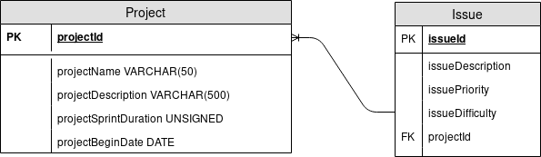

# TACHES DE DESIGN - CONDUITE DE PROJET

Description générale des composants de chacune des pages de notre projet.

# DESIGN DE LA PAGE DE CREATION DE USER STORY

Nom du fichier du formulaire: add_user_story.php

Nom du bouton de validation: "Valider"

Nom du bouton d'annulation: "Annuler"

c.f. la maquette pour les champs du formulaire

# DESIGN DE LA PAGE DU BACKLOG

Nom du fichier: list_backlog.php

Nom du bouton permettant d'ajouter une US: "Ajouter une User Story"

Nom du bouton permettant de retourner sur la page du projet: "Retour"

Nom du bouton permetttant de supprimer une US: "Supprimer"

c.f. la maquette pour la disposition de la liste

# DESIGN DE LA PAGE DE CREATION DE PROJET

Nom du fichier du formulaire : add_project.php
Nom du bouton de validation: "Valider"
Nom du bouton d'annulation: "Annuler"
c.f. la maquette pour les champs du formulaire

# DESIGN DE LA PAGE DE CONSULTATION DU PROJET

Nom du fichier: project_details.php
Nom du bouton permettant d'accéder à la page du Backlog : "Backlog"
Nom du bouton permettant d'accéder à la liste des sprints : "Sprints"
Nom du bouton permettant d'accéder à la page d'ajout de membre de projet : "Ajouter un membre"
Nom du bouton permettant d'accéder à la liste des membres du projet : "Membres"
Nom du bouton permettant de retourner à la liste des projets : "Retour"
c.f. la maquette pour visualiser les détails du projet

# DESIGN DE LA PAGE DE LA LISTE DES PROJETS

Nom du fichier: project_list.php
Id du du lien permettant d'accéder à la page de création de projet: "add_project_link"

# Base de données

## Sprint 1


## Sprint 2


# DAO
Les fonctions du fichier DAO.php seront:
```
void createProject($project);
Project[] getProjects();
void createUserStory($userStory);
UserStory[] getUserStories($projectId);
```
# Page d'accueil
Chemin du fichier: index.php
Nom du champ de login: 'username'
Nom du champ de mot de passe: 'password'


# Page d'inscription
Chemin du fichier: registration.php
Nom du champ pour l'identifiant: username
Nom du champ pour le mot de passe: password
Nom du champ pour l'addresse email: email
Nom du champ pour le nom: lastname
Nom du champ pour le prénom: firstname


# Page de déconnexion
Chemin du fichier: disconnect.php
(Redirige vers l'index)

# Stockage des mot de passes
Hachage des mots de passe avec l'algorithme Argon2

# DESIGN DE LA PAGE D'AJOUT D'UN UTILISATEUR A UN PROJET
Nom du fichier: add_user_to_project.php
Nom du champ pour ajouter l'utilisateur: username
Nom du bouton de validation: "Valider"

# DESIGN DE LA PAGE D'ACCES AUX INFORMATIONS DES MEMBRES DEPUIS UN PROJET
Nom du fichier: list_members_of_project.php
Nom du bouton permettant de retourner à la liste des projets : "Retour"

# DESIGN DE LA PAGE D'ACCES AUX SPRINTS D'UN PROJET

Nom du fichier: list_sprints_of_project.php

Nom du bouton permettant d'ajouter un sprint à un projet : "Ajouter un sprint"

Nom du bouton permettant de retourner à la liste des projets : "Retour"

# DESIGN DE LA PAGE DES TACHES DANS UN SPRINT

Nom du fichier: tasks_sprint.php

Nom des différentes colonnes permettant de trier les tâches: "To do", "On going", "Done"

Nom du bouton permettant d'ajouter une tâche: "Ajouter une tâche"

Nom du bouton permettant de supprimer le une tâche: "Supprimer"

# DESIGN DU POP-UP DE SUPPRESSION D'UNE USER STORY

Message du pop-up: "Voulez-vous supprimer cette US? Cette action sera irréversible."

Nom du bouton permettant de valider la suppression: "OK"

Nom du bouton permettant d'annuler la suppression: "Annuler"

Nom de la page gérant la suppression: delete_user_story.php
 
# DESIGN DU POP-UP DE SUPPRESSION D'UN SPRINT

Message du pop-up: "Voulez-vous supprimer ce sprint? Cette action sera irréversible."

Nom du bouton permettant de valider la suppression: "OK"

Nom du bouton permettant d'annuler la suppression: "Annuler"

Nom de la page gérant la suppression: delete_sprint.php
 
# DESIGN DU POP-UP D'ERREUR DE CONNEXION

Nom du pop-up: "Erreur lors de la connexion"

Message du pop-up: "Utilisateur ou mot de passe invalide/erroné. Veuillez réessayer."

Nom du bouton permettant de fermer le pop-up: "OK"
 
# DESIGN DU POP-UP D'ERREUR LORS DE L'INSCRIPTION

Message du pop-up: "Veuillez remplir la totalité des champs obligatoires."

Nom du bouton permettant de fermer le pop-up: "OK"
 
 
